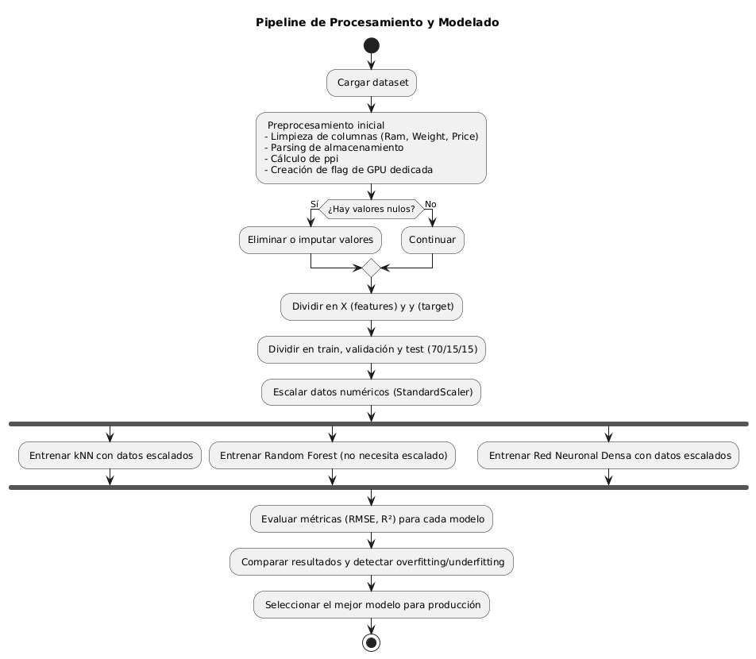

# ML-and-DL-lab
The purpose of this lab is to apply fundamental concepts of Machine Learning (ML) and Deep Learning (DL) for the analysis, preprocessing, training, and evaluation of predictive models. A complete process of data analysis and supervised modeling will be carried out, making decisions based on the exploration and results obtained.

